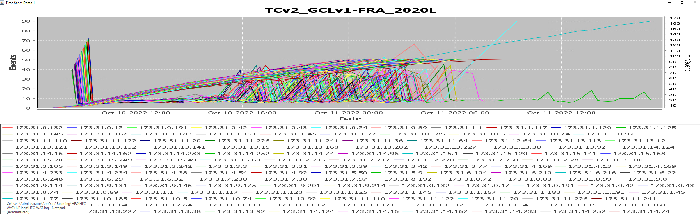

# DCChart

This program processes the logs of a WAT DC run and generates an image showing compute progress.

For example:

Developed in 2012 to monitor computes for:

Ripken, Ryan D., Joshua M. DeGeorge, John F. DeGeorge, Penni R. Baker, and Matthew J. Fleming. "Columbia River Treaty 2014/2024: Distributed Computing for HEC-WAT/FRA." In World Environmental and Water Resources Congress 2014, pp. 1680-1689. 2014.
https://ascelibrary.org/doi/abs/10.1061/9780784413548.166

